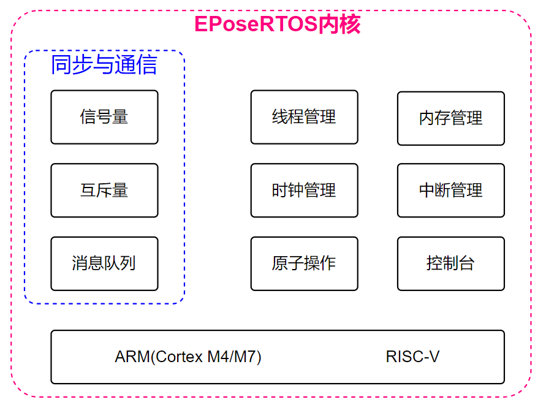
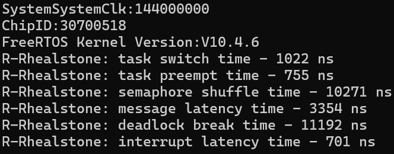
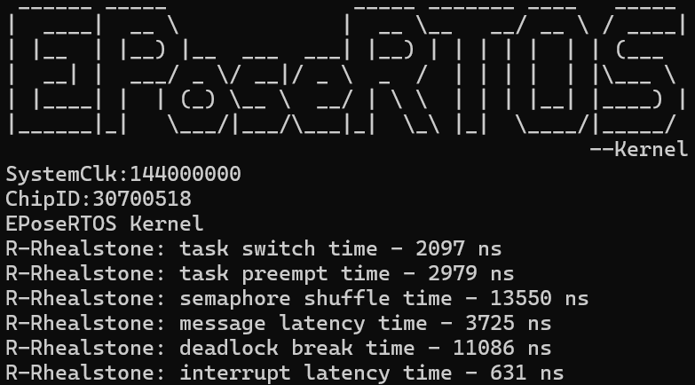
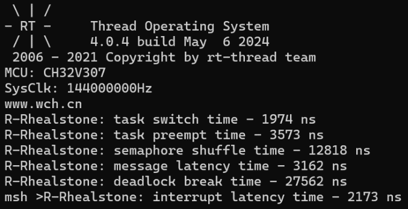
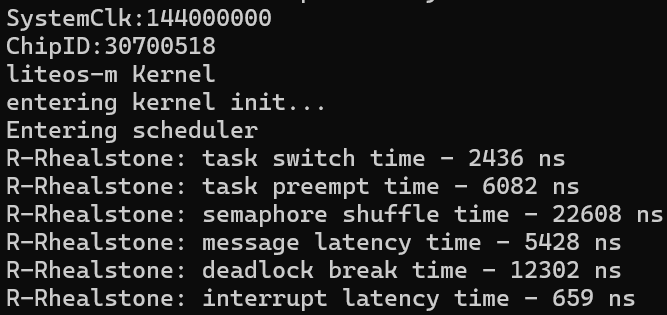

# EPoseRTOS

## 内核组成

## 内核优势

EPoseRTOS内核相比其他RTOS内核最大的优势是其“零中断延迟”技术。

中断延迟时间是指从硬件中断发生到执行中断服务程序(Interrupt Service Routine, ISR)的第一条指令所经过的时间。中断延迟时间t等于中断识别时间t_1，低优先级中断等待时间t_2与中断关闭时间t_3之和。

中断识别时间是指在无其他任何干扰下，从中断请求到将ISR入口地址送入程序计数器为止所经历的时间。低优先级中断等待时间是指当低优先级中断到达时，等待系统完成高优先级中断服务后开始处理该低优先级中断所经历的时间。中断关闭时间是指中断延迟过程中中断被关闭的时间。其中中断识别时间t_1是不可避免的，低优先级中断等待时间t_2具有不可避免的不确定性，中断关闭时间t_3是可避免的。因此，所谓“零中断延迟”并不是字面意义上的t=0，而是t=t_1+t_2。

RTOS内核为了管理系统资源，会存在许多全局变量，不当的数据访问可能会导致数据不一致和竞态条件等一系列问题。因此，许多内核代码片段不可避免使用临界区来进行保护。临界区是指在一段代码中，任何时刻只能有一个线程执行。而由于任务调度器依靠于中断，系统随时都有可能展开任务调度。因此，在临界区中，系统必须禁止任务调度，即必须关闭与任务调度器相关的中断。然而，在此前提下，系统如果支持在任何ISR中都可以调用内核服务应用程序接口 (application programming interface，API)，仅关闭与任务调度器相关的中断是不够的，必须关闭全局中断。此时，中断关闭时间存在不为零的概率，即该系统不能实现真正的“零中断延迟”。如果某任务正在调用内核API，并且刚好处在关闭全局中断的临界区中，有一个紧急的中断事件在此刻被触发，那么该中断就不能被得到及时执行。如果中断延迟时间大于紧急中断事件所能容忍的限度，危害是可想而知的。

目前互连网上也存在不少具备“零中断延迟”技术的RTOS，比如FreeRTOS、Keil RTX4/5、μCOS-Ⅱ/Ⅲ与ThreadX等等，然而它们或多或少存在一些限制。其中具备“零中断延迟”技术的RTOS中的大部分RTOS采用关闭指定优先级以下中断来替代关闭全局中断的方法。在此条件下，一些需要高实时性的高于“指定”优先级的中断将不受RTOS内核影响，比如在ARM Cortex-M3/M4/M7内核上，使用BASEPRI寄存器来关闭指定优先级以下的中断。但是，这种做法存在以下缺点：一是高于“指定”优先级的中断无法调用内核API；二是如果一些内核不具备BASEPRI寄存器相似功能的寄存器，“零中断延迟”就不具备移植到基于这些内核的CPU的条件。Keil RTX4/5的“零中断延迟”实现则采取另一种方法，它的内核API服务通过系统调用(Supervisor Call, SVC)以及可悬起的系统调用(Pend System Service Call, PendSV)来调用，再配合互斥访问指令，从而实现“零中断延迟”，并有效地隔离了应用代码与内核代码。Keil RTX4/5在任务上下文中的内核API调用通过SVC实现。而对于ISR内的内核API调用，Keil RTX4/5采取ISR FIFO(First In First Out, 先进先出)机制，将调用暂存，悬起PendSV, 在完全退出所有中断后，所有的调用在PendSV中按先后发布。然而Keil RTX4/5与ARM架构深度绑定，不利于将其移植到其他内核架构的CPU。类似于Keil RTX4/5的ISR FIFO，针对在ISR中的API调用，μCOS-Ⅲ提供了延迟发布选择。延迟发布配合调度器锁可以大幅减小关闭全局中断的时间，有利于提高系统的实时性。然而μCOS-Ⅲ的延迟发布存在以下缺点：一是在延迟发布中内核仍需采取关闭全局中断的方式进行临界区保护；二是需要创建一个最高优先级的任务用于专门发布延迟发布队列中的对象。

EPoseRTOS的“零中断延迟”实现吸纳Keil RTX4/5与μCOS-Ⅲ的优点，临界区均使用调度锁实现，在ISR中产生的所有调用均在PendSV(RISC-V架构在软件中断服务程序)中先后发布，并且在ISR中执行的延迟发布操作步骤比μCOS-Ⅲ的更为简易，仅有数条指令需要互斥访问，而这数条指令可以通过互斥访问`LDREX/STREX`指令(RISC-V架构为`LR/SC`指令)实现互斥访问，不需要关闭全局中断。如果运行在一个内核不支持原子指令的CPU，EPoseRTOS可以将原子操作改为通过关闭全局中断实现，但是需要关闭全局中断的临界区都非常短，仅有数条指令以内。

系统性能是选择一个系统需要关注的问题之一。对于实时系统，实时性能是至关重要的，值得关注。Rhealstone是系统实时性的测量基准之一。Rhealstone性能基准程序对实时系统的六个关键操作的时间量进行分析，这六个关键操作分别是：上下文切换时间、任务抢占时间、信号量混洗时间、通信传输延迟、死锁解除时间与中断延迟时间。

## 基准测试

本文在CH32V307处理器上对FreeRTOS、EPoseRTOS、RT-Thread以及LiteOS-m分别进行了Rhealstone基准测试，其测试数据如下图所示，可以发现EPoseRTOS内核的六个关键操作的性能均取得不错的成绩。

